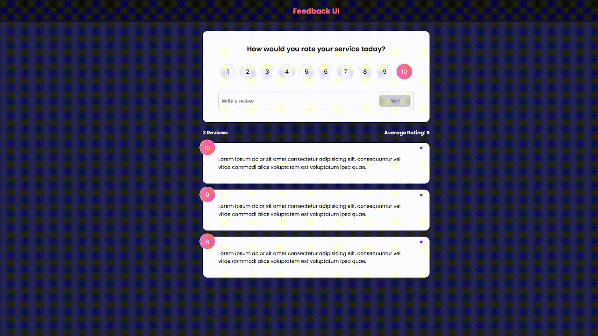

# feedback-app
This is a frontend UI for creating reviews/ratings. Users can select a rating of 1-10 and write a review of at least 10 characters. Reviews can be deleted. UI will update review count as well as an average rating. 

## How It's Made:

**Tech used:** 
HTML, CSS, JavaScript, React

**Preview:**

    

## Optimizations:
add edit review functionality
use context api to get rid of Prop Drilling
create backend

## Lessons Learned:
Learning a lot about component vs global state. Seeing how confusing prop drilling can get. 